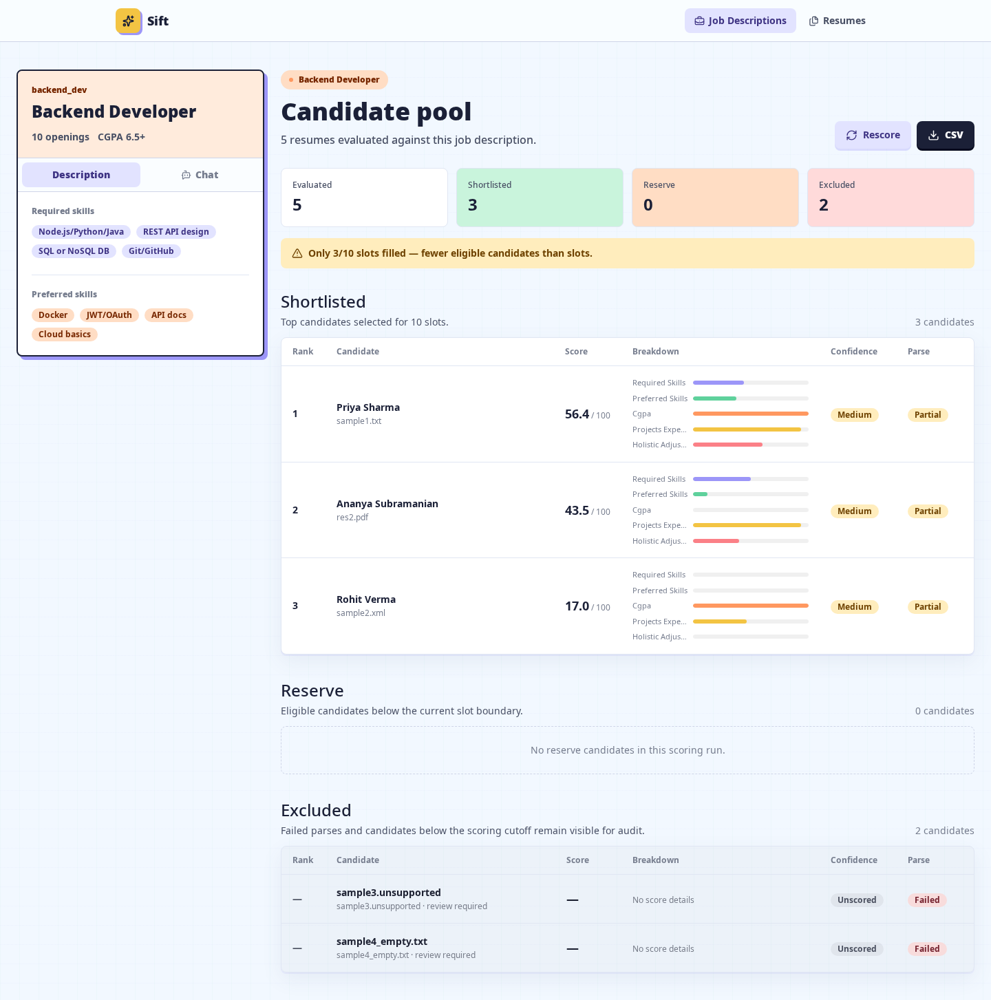
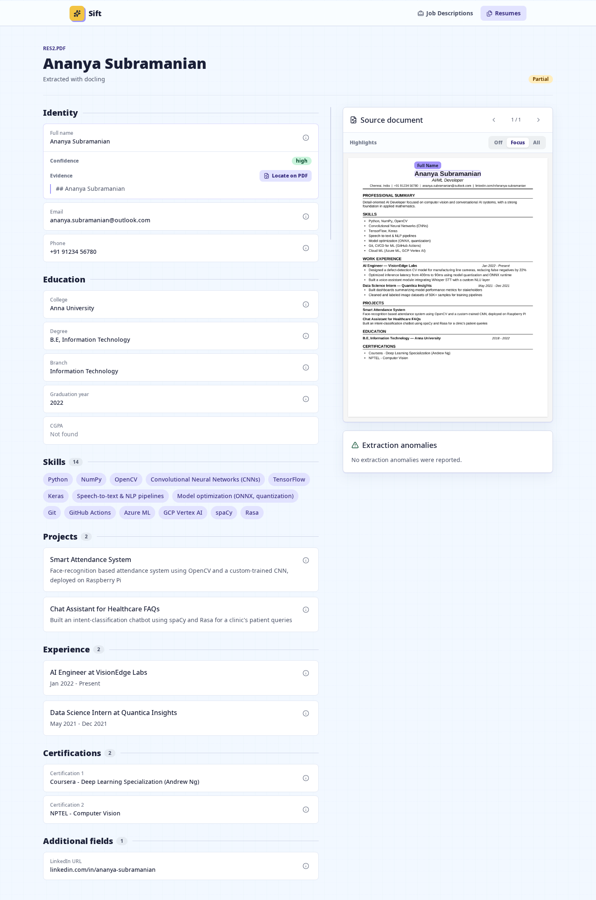

# InternLoom Resume Shortlisting Engine

An evidence-backed two-stage pipeline that extracts raw resumes, scores every candidate against any JD, and serves a recruiter UI with shortlist explanations, PDF source highlights, CSV export, and per-JD hybrid RAG chat.

## How This Differs From a Generic Resume Ranker

This is not a prompt that sends a resume and JD to an LLM and asks for a score. The system separates document recovery, extraction, deterministic scoring, and explanation so every decision can be inspected.

- **It shows its evidence.** Extracted fields retain verbatim quotes. PDF evidence is matched back to page geometry, rendered as labeled bounding boxes, and located directly from the field panel.
- **Python owns the decision.** Grade conversion, skill credits, score weights, structured filters, slot limits, and Shortlist/Reserve/Excluded placement are calculated in Python. LLM judgments are bounded inputs, not the final authority.
- **Bad inputs stay visible.** Partial parses cap score confidence. Failed parses receive no fabricated score, remain in the output, and are routed to human review.
- **Matching is tiered instead of binary.** Exact and synonym matches earn full credit; partial and implicit evidence earn reduced credit and stay visibly flagged.
- **Chat uses the right retrieval path.** Exact questions run against structured JSON; qualitative questions use JD-scoped vector retrieval; hybrid questions filter first and retrieve second. Every answer names its source resumes.
- **The result is reproducible.** Temperature-zero local models and content-addressed caches produce byte-identical output across the included three-run stability test.

## Product Views

### Split Candidate Workspace

The JD description and candidate chat remain available in the left pane while ranked Shortlisted, Reserve, and Excluded candidates stay visible in the candidate pool.



### Evidence-First Resume Review

Every extracted field can reveal its confidence and evidence, then locate and pulse the corresponding labeled region in the original PDF.



## Quick Start

Prerequisites: Python 3.11+, Node 20+, `uv`, an NVIDIA GPU for the supplied local model setup, and `llama-server` from llama.cpp.

```bash
uv venv --python 3.11
uv pip install --python .venv/bin/python -r requirements.txt
cd frontend && npm ci && npm run build && cd ..
```

Start the three OpenAI-compatible local model servers in separate terminals. Replace `/path/to/llama-server` if needed:

```bash
/path/to/llama-server -m /home/cosmos/models/downloaded/gemma-e4b/gemma-4-E4B-it-Q4_K_M.gguf --host 127.0.0.1 --port 8080 -ngl 99 -c 16384
/path/to/llama-server -m /home/cosmos/models/downloaded/qwen/qwen3-0.6b-q4_k_m.gguf --host 127.0.0.1 --port 8083 -ngl 99 -c 8192
/path/to/llama-server -m /home/cosmos/models/downloaded/embedding/Qwen3-Embedding-0.6B-Q8_0.gguf --host 127.0.0.1 --port 8082 -ngl 99 -c 8192 --embeddings --pooling last
```

Run the complete CLI pipeline on a folder of raw resumes:

```bash
.venv/bin/python -m resume_pipeline.cli /path/to/raw/resumes
.venv/bin/python score.py --resumes extracted --jds jds --out output
```

Or launch the API and built web app as one process:

```bash
.venv/bin/uvicorn backend.main:app --host 127.0.0.1 --port 8000
```

Open `http://127.0.0.1:8000`. Upload PDFs under Resumes, create or paste a JD under Jobs, then open the role to score, inspect evidence, export CSV, or chat with that candidate pool.

## Outputs

- `extracted/*.json`: structured resume records with evidence, field confidence, grade assumptions, and anomalies
- `parse_quality_report.md`: Clean/Partial/Failed status for every input
- `output/*_shortlist.json` and `.md`: ranked Shortlist, Reserve, and Excluded sections
- `output/summary.md`: evaluated count, shortlisted count, cutoff, and parse failures per JD

The committed parse report clearly separates the one actual PDF available in this workspace from synthetic regression fixtures. Run Stage 1 against the downloaded organizer folder before treating it as the full-dataset report.

## Scoring

All weights live in `scoring_config.yaml`: required skills 50, preferred skills 20, CGPA 10, projects/experience 15, and a bounded holistic adjustment of -5 to +5. Skill tiers are exact/synonym 100%, partial 50%, implicit 25%, missing 0%. Stage 2 is deterministic through temperature-zero calls plus a content-addressed disk cache.

## Verification

```bash
.venv/bin/python -m unittest discover -s tests
.venv/bin/python stability_test.py
cd frontend && npm run lint && npm run build && npx playwright test
```

Capture the documented recruiter flow while the app is running:

```bash
cd frontend && npm run screenshots
```

The PNG files are written to `docs/screenshots/`.

## Submission Checklist

- [x] Raw-folder Stage 1 CLI and importable extraction pipeline
- [x] Five supplied JDs (30 total slots) plus arbitrary JD CRUD
- [x] Ranked JSON and Markdown output with confidence, reasoning, parse flags, Reserve, and Excluded
- [x] Parse quality report with failed parses retained
- [x] Pinned `requirements.txt`
- [x] Sample output files
- [x] AI Usage Log (under 200 words)
- [x] Four-part Design Decisions document
- [x] Bonus A: web UI and CSV export
- [x] Bonus B: automatic low-yield OCR retry
- [x] Bonus C: pasted unstructured JD parsing
- [x] Bonus D: three-run byte-identical stability script
- [x] PDF provenance highlighting and per-JD hybrid RAG chat
- [x] Reproducible screenshots under `docs/screenshots/`

See [DESIGN_DECISIONS.md](DESIGN_DECISIONS.md), [AI_USAGE_LOG.md](AI_USAGE_LOG.md), and [parse_quality_report.md](parse_quality_report.md) for the required submission notes.
